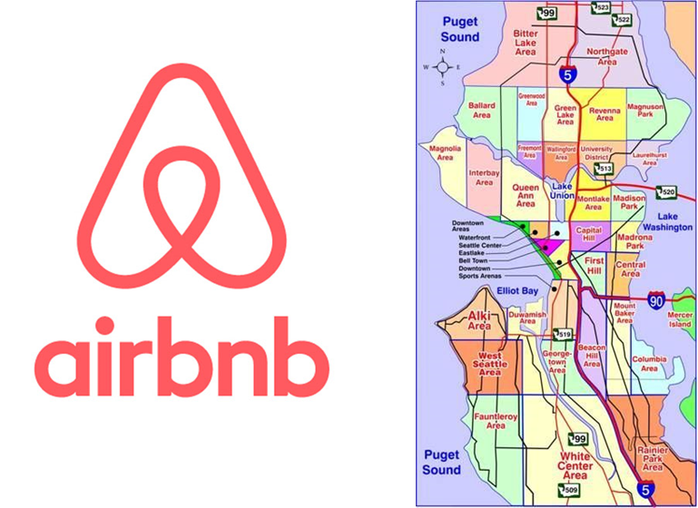
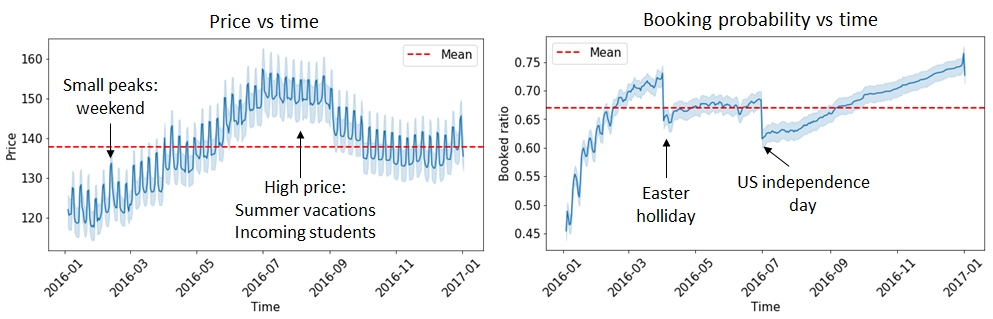
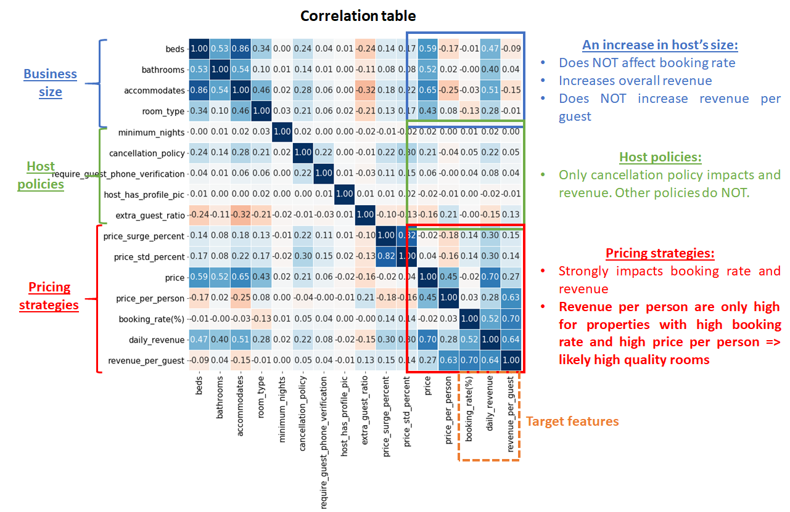
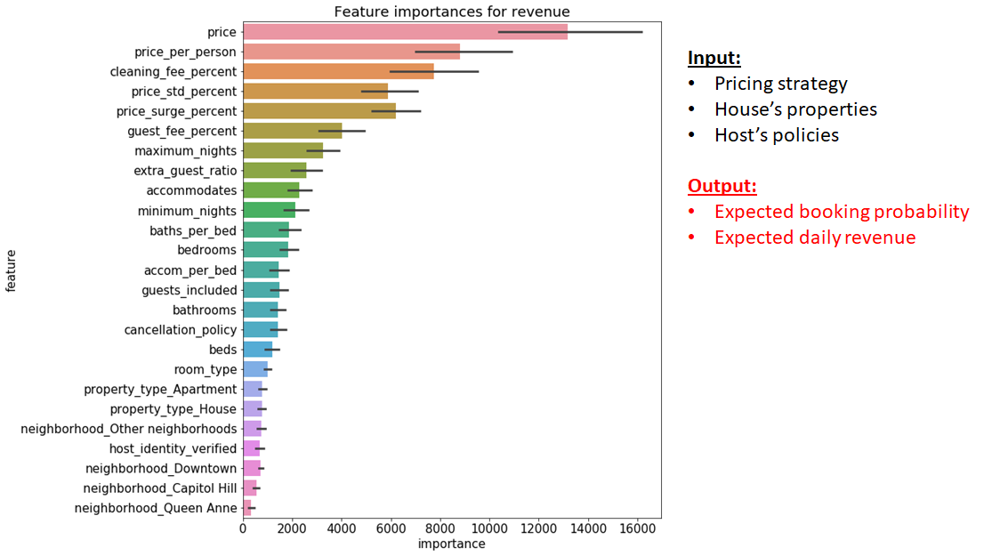

# Predicting-Airbnb-host-revenue-in-Seattle

## The business question

**A host is trying to enter the Airbnb business in Seattle, can you provide him/her with a housing and pricing strategy that can maximize the revenue?**

<ins>**How does this help Airbnb?**<ins>
* Maximizing hosts' return means maximizing Airbnb's commisions
* The code can be a core of a recommendation system that suggests pricing and policy for a new-coming host
* The code can be give Airbnb insight information on what category of potential host to reach out for marketing

## The solution

Using the [Kaggle's Airbnb Seattle dataset](https://www.kaggle.com/airbnb/seattle), I will perform EDA based on the host listing's:

* **House properties**: number of rooms, beds, apartment type, locations, etc.
* **Host policies**: number of extra guess allowed, cancellation policy, verification from rental, etc, as well as host self-verification
* **Pricing strategies**: price per person, cleaning fee, price surging over the year, etc.

A light gradient boosting machine is used with 5-fold cross-validation and MAE loss for revenue predictions.

The detailed analysis can be found in this [**notebook**](https://github.com/dmnguyen92/Predicting-Airbnb-host-revenue-in-Seattle/blob/master/main.ipynb)

A summary presentation can be found [**here**](https://github.com/dmnguyen92/Predicting-Airbnb-host-revenue-in-Seattle/blob/master/Presentation.pptx)

